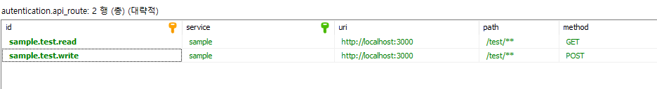
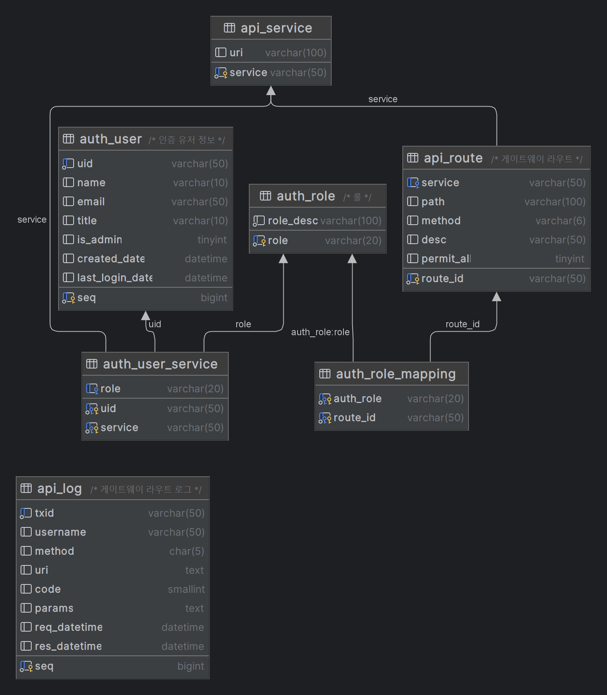

# spring authentication gateway

부트3기반의 게이트웨이 인증 통합 샘플 예시

- spring boot 3
- spring cloud gateway (netty)
- spring security
- 동적 route
- swagger(openapi)

> 게이트웨이 필터에서 라우트 별 권한 처리를 전부 다 하고 있어서 router target들에는 spring security는 크게 의미가 있진 않은 상태임 (게이트웨이 API 보안 처리)
> 라우트의 동적 등록, 갱신, 기본 필터 처리정도만 되어있다. 인증 및 예외 처리 응답 및 캐싱, fallback, 서킷브레이커 등 상세 설정은 알아서 따로 해야한다.
> 어드민 페이지 등등 필요에 의해 구현하면 된다. (나중에 심심하면 thymeleaf 로 구축?)



#### DB 구성



게이트웨이가 모든 권한/인증을 담당하는 구조. 로그인 시 서비스 별 권한이 전부 별도로 생성된다.   
관련해서는 정책에 따라 로그인 시의 권한 부여를 고민하고 수정해도 된다.   


#### 권한 구조

슈퍼 어드민(모든 서비스) >>> 서비스 어드민(개별 서비스) >>> 일반 유저(개별 서비스 권한)

```
public static final String DEFAULT_ROLE_NAME = "NONE";              // 기본 권한 이름
public static final String ADMIN_ROLE_NAME = "SYSADMIN";            // 슈퍼 어드민 이름 (권한 리스트 제외 - 게이트웨이 필터부터 모두 통과처리)
public static final String SERVICE_ADMIN_CONTAINS_KEY = "ADMIN";    // 서비스 관리자 이름 (auth_role에 서비스별로 정의 ex- LOGIN_ADMIN)
                                                                    // 해당 키가 포함된 auth_role을 가진 유저는 해당 서비스의 모든 권한을 부여받는다
                                                                    // 일반 유저와 동일하게 필터를 거치나, 권한을 모두 갖는 케이스
public static final String ROLE_PREFIX = "ROLE_";                   // 권한 프리픽스 (내부 서비스 제어 용)
```
> 권한의 설계는 정책별로 자유이며, 대강 이렇게도 된다는 식의 코드 부분부분적인 레벨을 제어

#### 사용 예시

1. authentication.api_service에 서비스를 등록한다.
   - [service-name], [uri]
   - uri는 프로토콜을 포함한다. ex) http://test.com, lb://EUREKA-SERVICE-NAME, lb:ws://EUREKA-SERVICE-NAME (websocket)
2. authentication.api_route에 라우팅 대상을 등록한다.
   - route_id는 식별할만한 유니크 키 ex) svs.post.read
   - service는 서비스 구분키 이면서 eureka client application name이다.
   - path는 /posts/** /posts/* 같은 패턴 방식이 가능하다.
   - method는 현재는 단일 Method나, 내부 코드 수정을 통해 *과 같은 다중 처리의 형태도 추가할 수 있다. (현재 공백 => 전체 Method임)
   - permit_all은 인증되지 않은 모든 사용자도 접근 가능하게 하는 Flag이다.
3. 호출
   - Method GW-HOST:GW-PORT/[service-name]/[service-api-routes] 의 방식으로 호출하면 된다.
   - 내부 GW의 기능은 별도 정의된 SecurityConfig 및 권한 처리로 처리한다.

#### swagger 

> http://localhost:8080/swagger-ui.html


## spring data r2dbc

method interface 말고 다른 호출 방법 예시
[공식참조][ref]

Select
```
Mono<Person> first = template.select(Person.class)	
	.from("other_person")
	.matching(query(where("firstname").is("John")			
		.and("lastname").in("Doe", "White"))
	  .sort(by(desc("id"))))													
	.one();		
```

Insert
```
Mono<Person> insert = template.insert(Person.class)	
		.using(new Person("John", "Doe"));
```

Modifty
```
Mono<Long> update = template.update(Person.class)	
				.inTable("other_table")														
				.matching(query(where("firstname").is("John")))		
				.apply(update("age", 42));		
```

Delete
```
Mono<Long> delete = template.delete(Person.class)	
				.from("other_table")															
				.matching(query(where("firstname").is("John")))		
				.all();		
```

---

```java
public interface PostRepository extends R2dbcRepository<Post, Long> {
    @Query("""
                SELECT *
                FROM post p
                WHERE p.title LIKE CONCAT('%', :keyword, '%') OR
                    p.content LIKE CONCAT('%', :keyword, '%')
            """)
    Flux<Post> searchByKeyword(String keyword);
}
```

```java
@Repository
@RequiredArgsConstructor
public class PostCustomRepository {

    private final DatabaseClient databaseClient;

    public Flux<Post> searchByKeyword(String keyword) {
        var containKeywordSQL = """
                    SELECT *
                    FROM post p
                    WHERE p.title LIKE CONCAT('%', :keyword, '%') OR
                        p.content LIKE CONCAT('%', :keyword, '%')
                """;

        return databaseClient.sql(containKeywordSQL)
                       .bind("keyword", keyword)
                       .fetch().all()
                       .map(row -> Post.builder()
                                           .id((Long) row.get("id"))
                                           .title((String) row.get("title"))
                                           .content((String) row.get("content"))
                                           .createdAt((LocalDateTime) row.get("created_at"))
                                           .updatedAt((LocalDateTime) row.get("updated_at"))
                                           .build());
    }

}
```
> intellij에서 datagrip을 연동해놓으면 Query에 대하여 힌트가 적용된다.

#### 기타
service apm??

- elastic APM (다양한 언어 지원)
- scouter (써봄, JVM 위주)

#### r2dbc

[참고][ref2]

[ref]: https://docs.spring.io/spring-data/relational/reference/r2dbc/entity-persistence.html
[ref2]: https://docs.spring.io/spring-framework/reference/data-access/r2dbc.html
